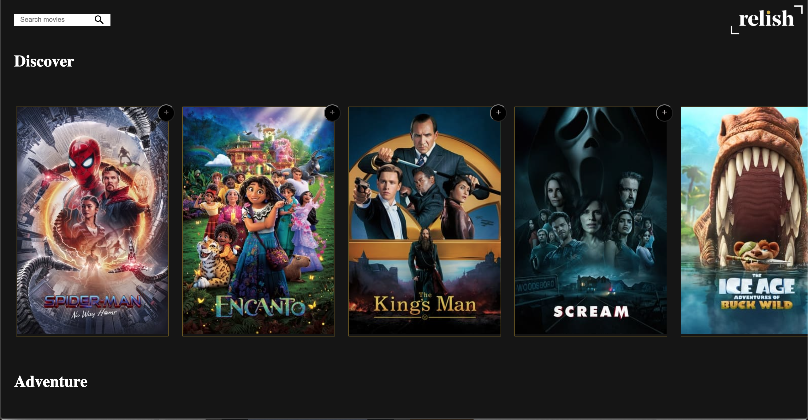

## Relish Movie App

Deployed on
[Relish Movie App](https://gentjanad.github.io/Movie-Review/)

Building a Movie App with React and Webpack, that displays a list of movies from an api.
 
 

 

Purpose of this repo is to test and work with different technilogies.

### App Functionality

1. The App displays a list of movies by categories fetched from an api with three different endpoints.
2. The user is able to search movies by title and to add to watchlist/favorites.
3. The user can remove selected movies from favorites list.
4. The user can hover on each Movie tile and click on it to see a Modal with more information.
   1. Using React Portal for Modal

### Tech Stack

- React and Webpack
- Redux for global state management
- Redux-thunk as a middleware for asynchronous fetching
- Typescript
- Figma
- Adobe Illustrator

#### Next Steps

1. Add Movie Categories to the Nav Bar. Upon clicking each category, the page should scroll to pertaining section.
2. Add state persistence
3. Add more styling

### Toolchain

Toolchain configured manually

- Package Manager - NPM
- Bundler - Webpack
- Compiler - Babel
